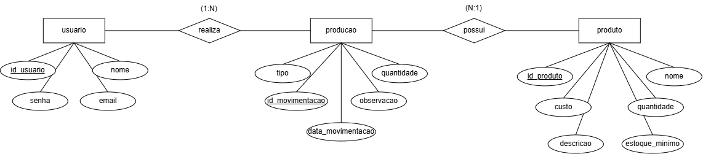
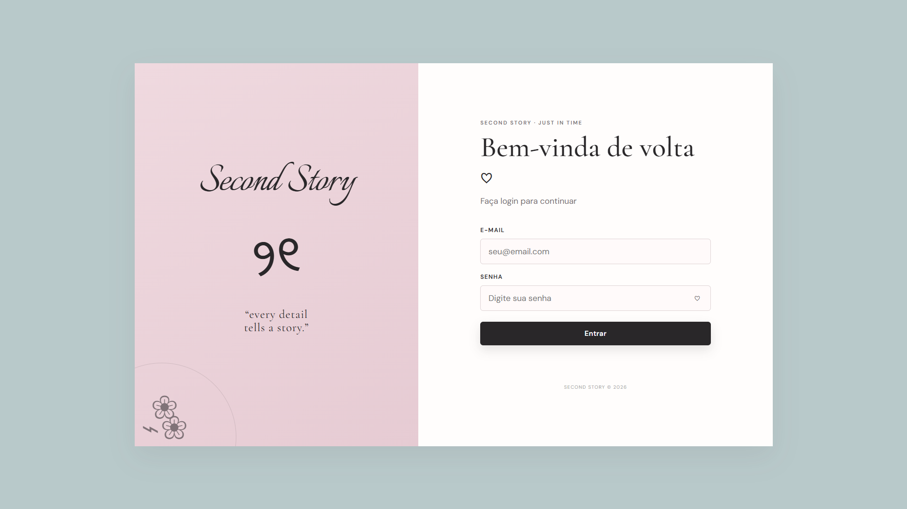
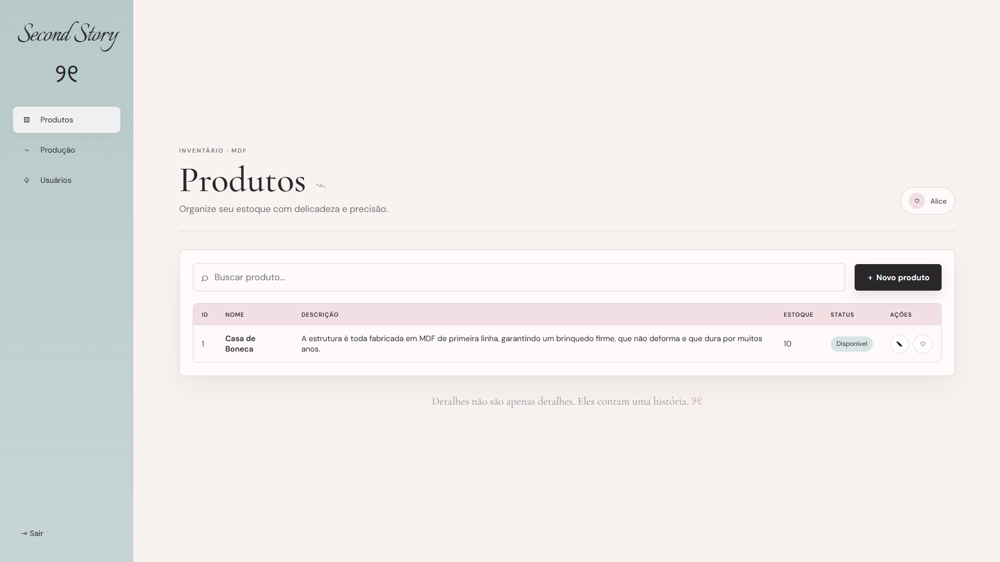
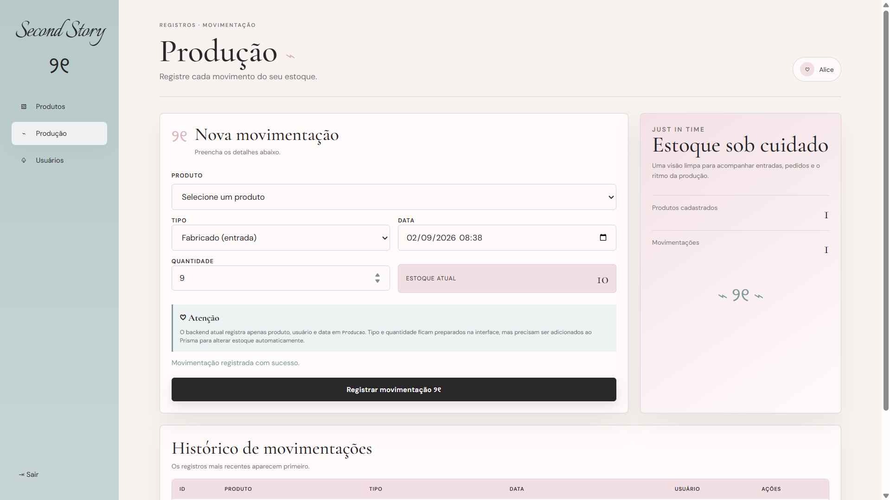
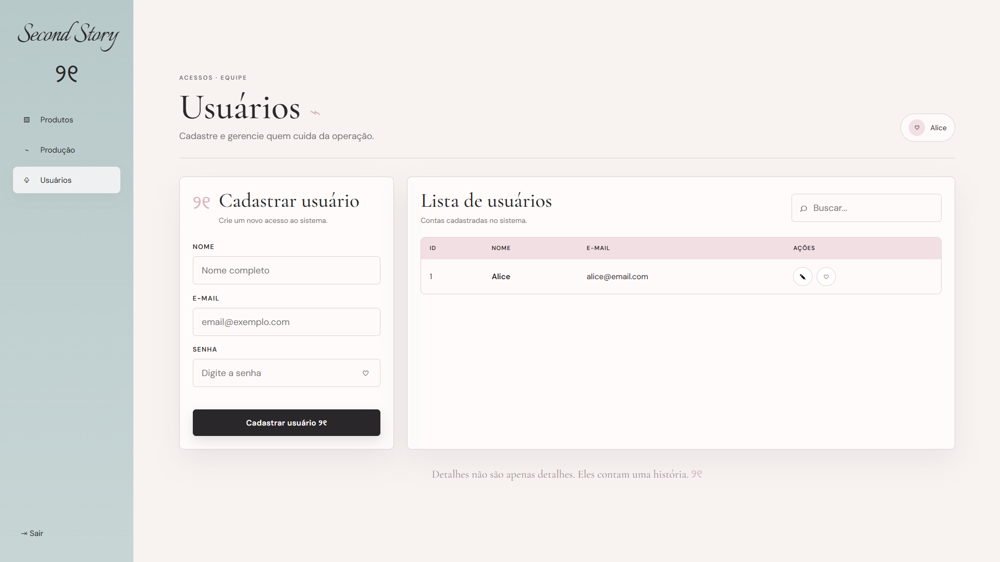

# Fábrica MDF - Just in Time | FullStack

Repositório desenvolvido para a **Atividade Avaliativa FullStack - SENAI 2026 / 2° Semestre** com foco em controle de estoque no modelo **Just in Time** para uma fábrica de MDF.

Sistema completo com **Back-End em Node + Prisma + MariaDB** e **Front-End** em HTML, CSS e JS.

---

## 🗄 Back-End 

Back-end responsável por usuários, produtos e produção de estoque.

### 📌 Objetivo

Criar um sistema Just in Time onde:
- Produtos com estoque abaixo do mínimo são alertados
- Produção que atualizam o estoque automaticamente
- Acesso restrito via login de usuário

### 🛠 Tecnologias

- Node.js + Express
- Prisma ORM v5.22.0
- MariaDB / MySQL
- Dotenv

### 📁 Estrutura

```text
Back-End/
└── Fábrica MDF/
    └── just_in_time/
        ├── prisma/
        │   ├── schema.prisma
        │   └── migrations/
        ├── src/
        │   ├── routes/
        │   └── server.js
        ├── .env
        └── package.json
```

### 💻 Schema Prisma

```prisma
model Usuario {
  id    Int    @id @default(autoincrement())
  nome  String
  email String @unique
  senha String

  producaos Producao[]
}

model Produto {
  id        Int    @id @default(autoincrement())
  nome      String
  descricao String
  estoque   Int

  producaos Producao[]
}

model Producao {
  id        Int      @id @default(autoincrement())
  produtoId Int
  usuarioId Int
  data      DateTime

  produto Produto @relation(fields: [produtoId], references: [id])
  usuario Usuario @relation(fields: [usuarioId], references: [id])
}
```

### 📊 DER - Diagrama Entidade Relacionamento

<p align="center">
  
</p>

- **usuario (1) — (N) movimentacao**
- **produto (1) — (N) movimentacao**

### ▶ Como rodar o Back

```bash
cd Back-End/Fábrica\ MDF/just_in_time
npm install
npx prisma generate
# crie o banco preparacao_db no MariaDB
npx prisma migrate dev --name init
npm run dev 
```

API roda em `http://localhost:3000`

---

## 🌐 Front-End - Acesso Restrito

Front em HTML/CSS/JS.

### 📁 Estrutura

```text
just_in_time/
├── index.html         
├── produtos.html       
├── producao.html 
├── style.css           
└── script.js           
localStorage
```
---

## 🖥 Telas

### Login 
<p align="center">
  
</p>

### Produtos
<p align="center">
  
</p>

### Produção
<p align="center">
  
</p>

### Usuários
<p align="center">
  
</p>

---

## 🚀 Como rodar o projeto completo

1. **Banco:** `CREATE DATABASE preparacao_db;` no MariaDB do VS Code
2. **Back:** `npx prisma migrate dev --name init` + `npm run dev`
3. **Front:** abrir `just_in_time/index.html` no navegador (Live Server)

Front funciona offline com localStorage se o back estiver desligado.

---

## Desenvolvido por

<div align="center">

─── ✦ 🎀 ✦ ───

*♡ feito com todo carinho e delicadeza por*

**✦ Alice ✦**

> *“less excess, more charm — just the essentials, beautifully made”* ♡

· · · ♡ · · ·

</div>